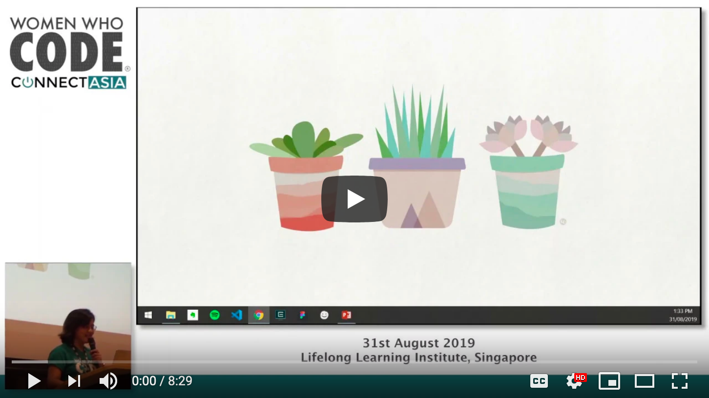

# Web Development for Beginners - A Curriculum

Azure Cloud Advocates at Microsoft are pleased to offer a 12-week, 24-lesson curriculum all about JavaScript, CSS, and HTML basics. Each lesson includes pre- and post-lesson quizzes, written instructions to complete the lesson, a solution, an assignment and more. Our project-based pedagogy allows you to learn while building, a proven way for new skills to 'stick'.

> Teachers, we have [included some suggestions](for-teachers.md) on how to use this curriculum. If you would like to create your own lessons, we have also included a [lesson template](lesson-template/README.md)

> Click the image above for a video about the project and the folks who created it!

## Pedagogy

We have chosen two pedagogical tenets while building this curriculum: ensuring that it is project-based and that it includes frequent quizzes. By the end of this series, students will have built a typing game, a virtual terrarium, a 'green' browser extension, a 'space invaders' type game, and a business-type banking app, and will have learned the basics of JavaScript, HTML, and CSS along with the modern toolchain of today's web developer.

By ensuring that the content aligns with projects, the process is made more engaging for students and retention of concepts will be augmented. We also wrote several starter lessons in JavaScript basics to introduce concepts, paired with video from the "[Beginners Series to: JavaScript](https://channel9.msdn.com/Series/Beginners-Series-to-JavaScript?WT.mc_id=cxaall-4621-cxall)" collection of video tutorials, some of whose authors contributed to this curriculum.

In addition, a low-stakes quiz before a class sets the intention of the student towards learning a topic, while a second quiz after class ensures further retention. This curriculum was designed to be flexible and fun and can be taken in whole or in part. The projects start small and become increasingly complex by the end of the 12 week cycle.

While we have purposefully avoided introducing JavaScript frameworks so as to concentrate on the basic skills needed as a web developer before adopting a framework, a good next step to completing this curriculum would be learning about Node.js via another collection of videos: "[Beginner Series to: Node.js](https://channel9.msdn.com/Series/Beginners-Series-to-Nodejs?WT.mc_id=cxaall-4621-cxall)".

> Find our [Code of Conduct](CODE_OF_CONDUCT.md) and [Contributing](CONTRIBUTING.md) guidelines. We welcome your constructive feedback!
>
## Each lesson includes:

- optional sketchnote
- optional supplemental video
- pre-lesson warmup quiz
- written lesson
- for project-based lessons, step-by-step guides on how to build the project
- knowledge checks
- a challenge
- supplemental reading
- assignment
- post-lesson quiz

## Lessons

|       |                       Project Name                       |                            Concepts Taught                             | Learning Objectives                                                                                                                 |                                                         Linked Lesson                                                          | Written Lesson | Sketchnote | Assignment | Starting Quiz | Ending Quiz | Video |         Author          |
| :---: | :------------------------------------------------------: | :--------------------------------------------------------------------: | ----------------------------------------------------------------------------------------------------------------------------------- | :----------------------------------------------------------------------------------------------------------------------------: | :------------: | :--------: | :--------: | :-----------: | :---------: | :---: | :---------------------: |
|  01   |                     Getting Started                      |           Introduction to Programming and Tools of the Trade           | Learn the basic underpinnings behind most programming languages and about software that helps professional developers do their jobs | [Intro to Programming Languages and Tools of the Trade](/1-getting-started-lessons/1-intro-to-programming-languages/README.md) |       ✅        |     ✅      |     ✅      |       ✅       |      ✅      |   ✅   |         Jasmine         |
|  02   |                     Getting Started                      |             Basics of GitHub, includes working with a team             | How to use GitHub in your project, how to collaborate with others on a code base                                                    |                            [Intro to GitHub](/1-getting-started-lessons/2-github-basics/README.md)                             |       ✅        |     ✅      |     ✅      |       ✅       |      ✅      |   🛑   |          Floor          |
|  03   |                     Getting Started                      |                             Accessibility                              | Learn the basics of web accessibility                                                                                               |                       [Accessibility Fundamentals](/1-getting-started-lessons/3-accessibility/README.md)                       |       ✅        |     ✅      |     ✅      |       ✅       |      ✅      |   🛑   |       Christopher       |
|  04   |                        JS Basics                         |                         JavaScript Data Types                          | The basics of JavaScript data types                                                                                                 |                                       [Data Types](/2-js-basics/1-data-types/README.md)                                        |       ✅        |     ✅      |     ✅      |       ✅       |      ✅      |   ✅   |         Jasmine         |
|  05   |                        JS Basics                         |                         Functions and Methods                          | Learn about functions and methods to manage an application's logic flow                                                             |                              [Functions and Methods](/2-js-basics/2-functions-methods/README.md)                               |       ✅        |     ✅      |     ✅      |       ✅       |      ✅      |   ✅   | Jasmine and Christopher |
|  06   |                        JS Basics                         |                        Making Decisions with JS                        | Learn how to create conditions in your code using decision-making methods                                                           |                                 [Making Decisions](/2-js-basics/3-making-decisions/README.md)                                  |       ✅        |     ✅      |     ✅      |       ✅       |      ✅      |   ✅   |         Jasmine         |
|  07   |                        JS Basics                         |                            Arrays and Loops                            | Work with data using arrays and loops in JavaScript                                                                                 |                                   [Arrays and Loops](/2-js-basics/4-arrays-loops/README.md)                                    |       ✅        |     ✅      |     ✅      |       ✅       |      ✅      |   ✅   |         Jasmine         |
|  08   |       [Terrarium](/3-terrarium/solution/README.md)       |                            HTML in Practice                            | Build the HTML to create an online terrarium, focusing on building a layout                                                         |                                 [Introduction to HTML](/3-terrarium/1-intro-to-html/README.md)                                 |       ✅        |     ✅      |     ✅      |       ✅       |      ✅      |   🛑   |           Jen           |
|  09   |       [Terrarium](/3-terrarium/solution/README.md)       |                            CSS in Practice                             | Build the CSS to style the online terrarium, focusing on the basics of CSS including making the page responsive                     |                                  [Introduction to CSS](/3-terrarium/2-intro-to-css/README.md)                                  |       ✅        |     ✅      |     ✅      |       ✅       |      ✅      |   🛑   |           Jen           |
|  10   |            [Terrarium](/3-terrarium/solution)            |                 JavaScript Closures, DOM manipulation                  | Build the JavaScript to make the terrarium function as a drag/drop interface, focusing on closures and DOM manipulation             |                  [JavaScript Closures, DOM manipulation](/3-terrarium/3-intro-to-DOM-and-closures/README.md)                   |       ✅        |     ✅      |     ✅      |       ✅       |      ✅      |   🛑   |           Jen           |
|  11   |          [Typing Game](/4-typing-game/solution)          |                          Build a Typing Game                           | Learn how to use keyboard events to drive the logic of your JavaScript app                                                          |                                [Event-Driven Programming](/4-typing-game/typing-game/README.md)                                |       ✅        |     🛑      |     ✅      |       ✅       |      ✅      |   ✅   |       Christopher       |
|  12   | [Green Browser Extension](/5-browser-extension/solution) |                         Working with Browsers                          | Learn how browsers work, their history, and how to scaffold the first elements of a browser extension                               |                               [About Browsers](/5-browser-extension/1-about-browsers/README.md)                                |       ✅        |     ✅      |     ✅      |       ✅       |      ✅      |   🛑   |           Jen           |
|  13   | [Green Browser Extension](/5-browser-extension/solution) | Building a form, calling an API and storing variables in local storage | Build the JavaScript elements of your browser extension to call an API using variables stored in local storage                      |                [APIs, Forms, and Local Storage](/5-browser-extension/2-forms-browsers-local-storage/README.md)                 |       ✅        |     🛑      |     ✅      |       ✅       |      ✅      |   ✅   |           Jen           |
|  14   | [Green Browser Extension](/5-browser-extension/solution) |          Background processes in the browser, web performance          | Use the browser's background processes to manage the extension's icon; learn about web performance and some optimizations to make   |             [Background Tasks and Performance](/5-browser-extension/3-background-tasks-and-performance/README.md)              |       ✅        |     🛑      |     ✅      |       ✅       |      ✅      |   🛑   |           Jen           |
|  15   |           [Space Game](/6-space-game/solution)           |             More Advanced Game Development with JavaScript             | Learn about Inheritance using both Classes and Composition and the Pub/Sub pattern, in preparation for building a game              |                      [Introduction to Advanced Game Development](/6-space-game/1-introduction/README.md)                       |       ✅        |     🛑      |     ✅      |       ✅       |      ✅      |   🛑   |          Chris          |
|  16   |           [Space Game](/6-space-game/solution)           |                           Drawing to canvas                            | Learn about the Canvas API, used to draw elements to a screen                                                                       |                                [Drawing to Canvas](/6-space-game/2-drawing-to-canvas/README.md)                                |       ✅        |     🛑      |     ✅      |       ✅       |      ✅      |   🛑   |          Chris          |
|  17   |           [Space Game](/6-space-game/solution)           |                   Moving elements around the screen                    | Discover how elements can gain motion using the cartesian coordinates and the Canvas API                                            |                           [Moving Elements Around](/6-space-game/3-moving-elements-around/README.md)                           |       ✅        |     🛑      |     ✅      |       ✅       |      ✅      |   🛑   |          Chris          |
|  18   |           [Space Game](/6-space-game/solution)           |                          Collision detection                           | Make elements collide and react to each other using keypresses and provide a cooldown function to ensure performance of the game    |                              [Collision Detection](/6-space-game/4-collision-detection/README.md)                              |       ✅        |     🛑      |     ✅      |       ✅       |      ✅      |   🛑   |          Chris          |
|  19   |           [Space Game](/6-space-game/solution)           |                             Keeping score                              | Perform math calculations based on the game's status and performance                                                                |                                    [Keeping Score](/6-space-game/5-keeping-score/README.md)                                    |       ✅        |     🛑      |     ✅      |       ✅       |      ✅      |   🛑   |          Chris          |
|  20   |           [Space Game](/6-space-game/solution)           |                     Ending and restarting the game                     | Learn about ending and restarting the game, including cleaning up assets and resetting variable values                              |                                [The Ending Condition](/6-space-game/6-end-condition/README.md)                                 |       ✅        |     🛑      |     ✅      |       ✅       |      ✅      |   🛑   |          Chris          |
|  21   |         [Banking App](/7-bank-project/solution)          |                 HTML Templates and Routes in a Web App                 | Learn how to create the scaffold of a multipage website's architecture using routing and HTML templates                             |                            [HTML Templates and Routes](/7-bank-project/1-template-route/README.md)                             |       ✅        |     🛑      |     ✅      |       ✅       |      ✅      |   ✅   |          Yohan          |
|  22   |         [Banking App](/7-bank-project/solution)          |                  Build a Login and Registration Form                   | Learn about building forms and handing validation routines                                                                          |                                           [Forms](/7-bank-project/2-forms/README.md)                                           |       ✅        |     🛑      |     ✅      |       ✅       |      ✅      |   ✅   |          Yohan          |
|  23   |         [Banking App](/7-bank-project/solution)          |                   Methods of Fetching and Using Data                   | How data flows in and out of your app, how to fetch it, store it, and dispose of it                                                 |                                            [Data](/7-bank-project/3-data/README.md)                                            |       ✅        |     🛑      |     ✅      |       ✅       |      ✅      |   ✅   |          Yohan          |
|  24   |         [Banking App](/7-bank-project/solution)          |                      Concepts of State Management                      | Learn how your app retains state and how to manage it programmatically                                                              |                                [State Management](/7-bank-project/4-state-management/README.md)                                |       ✅        |     🛑      |     ✅      |       ✅       |      ✅      |       |          Yohan          |

## Offline access

You can run this documentation offline by using [Docsify](https://docsify.js.org/#/). Fork this repo, [install Docsify](https://docsify.js.org/#/quickstart) on your local machine, and then in the root folder of this repo, type `docsify serve`. The website will be served on port 3000 on your localhost: `localhost:3000`.

# Docsify Open Lessons Template

🚀 Quick Install Instructions
---
**Pre-flight Checklist**  

1. GitHub account

**Installation Steps**  

1. Tap **Use this template** on the source repository (upper-right green button)
2. Choose the name for your new repository to contain the copied site files and then tap **Create repository from template**
2. Go to **Settings** of your newly created repository, scroll down to **GitHub Pages** and chose **main** (see more details in the [Docsify documentation](https://docsify.now.sh/deploy?id=gitlab-pages))
3. And you're done! (view your new site using the provided URL right below your **GitHub Pages** section - it can take up to 20 minutes for your site to be initially available)

## 💻 Editing this site locally

1. Tap **Clone** on your repository page
2. Choose **Open Desktop** and follow the prompts, installing GitHub Desktop if not already present
3. You will now be able to edit your Docsify site using the desktop editor of your choice (e.g. atom.io)
4. Use GitHub Desktop to push any changes to your repository. [Learn more about using GitHub Desktop](https://help.github.com/en/desktop/contributing-to-projects/committing-and-reviewing-changes-to-your-project).

## 🔗 Changing the GitHub link

1. Edit the file `index.html` in your repository
2. Find the sample GitHub repository URL `https://github.com/hibbitts-design/docsify-open-lessons-web-dev-for-beginners` and replace it with your own repository URL, for example `https://github.com/YourGitHubUsername/Docsify/blob/master/docs/`
3. Commit your changes.

## 📼 Docsify install/config

  
_Video 1. Generating Documentation Sites with GitHub and Docsify - Alysson Alvaran_

## 📚 Learn more about Docsify

[Docsify Documentation](https://docsify.js.org/#/?id=docsifyg)

## ‍🙇 Credits and special thanks

[Web Dev For Beginners](https://github.com/microsoft/Web-Dev-For-Beginners)  
[Docsify Themeable](https://github.com/jhildenbiddle/docsify-themeable)  
